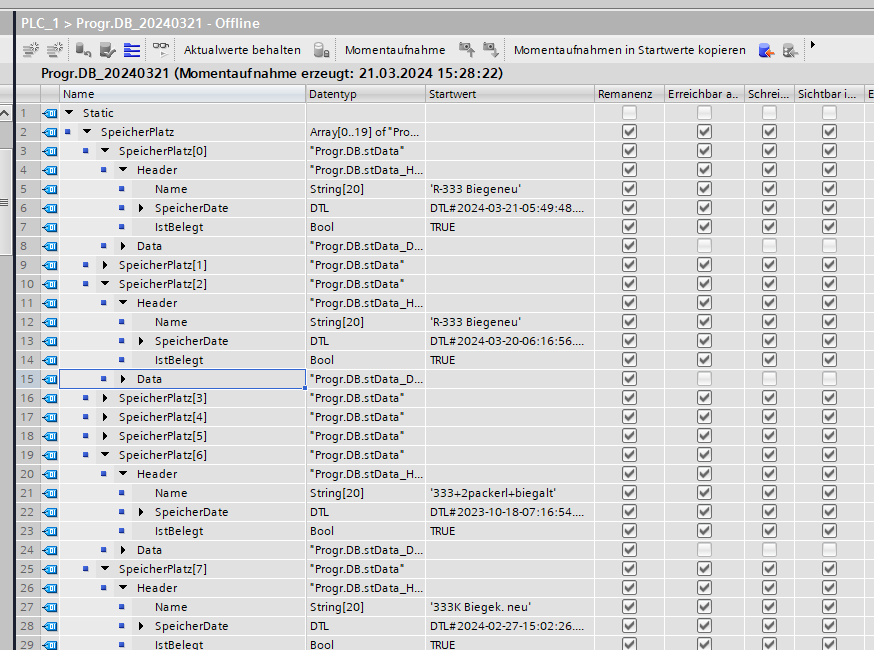

## Inbox
- [P23-1129 TPI Modul V2 Regie](../pages/Projekte/TPI%20TPI-Modul%20V2/P23-1129%20TPI%20Modul%20V2%20Regie.md)
	- Screw SEW Umrichter Momentbegrenzungen auf Wunsch TPI erhöht (Motorkabel zu klein)
		- In HMI Einstellungen Obergrenze Drehmoment von 80 auf 200%
		- SEW Umrichter Strombegrenzung von 64 A auf 170A erhöht
	- Über Fernwartung - Verbindungsprobleme. für SEW Software muss Route eingerichtet werden. `route add 192.168.51.0 MASK 255.255.255.0 192.168.52.2`
	- Zeit 06:45 - bis 07:30 + In Autofahrt 
- Prefa Rinnenhaken
	- Probleme Programme passen nicht mehr. Angeblich durch SPS-Änderungen verloren
	-  Fehlersuche, bei RiHa1 nur falsches Programm gewählt, da 2 den selben Namen haben. Programm  Nummer 2 sollte eigentlich gewählt werden.
	- 