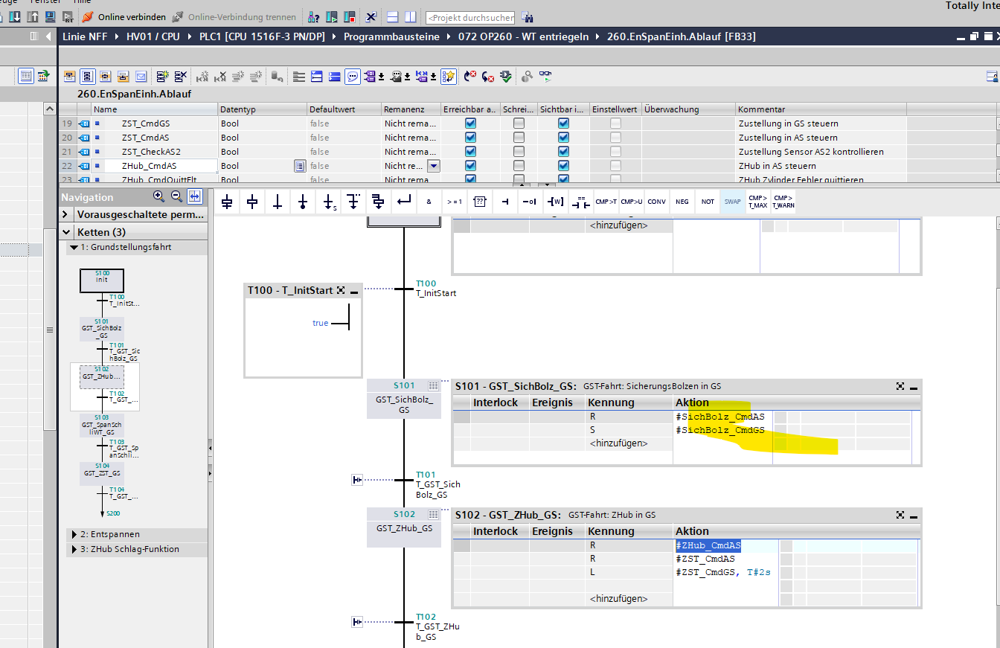
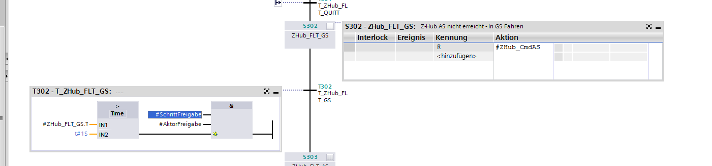

[ToDo](ToDo)
- [x] Samsung NFF OP260 Z-Hub Ablaufänderungen
	- [x] Bei Grundstellungsfahrt muss Z-Hub schon in GS gesteuert werden, da Federn eingebaut
	- 
	- [x] Bei "Schlagfunktion" länger in GS bleiben
	- 
	- GS Zeit von 1s auf 2s geändert
	- AS Zeit von 2s auf 3s geändert