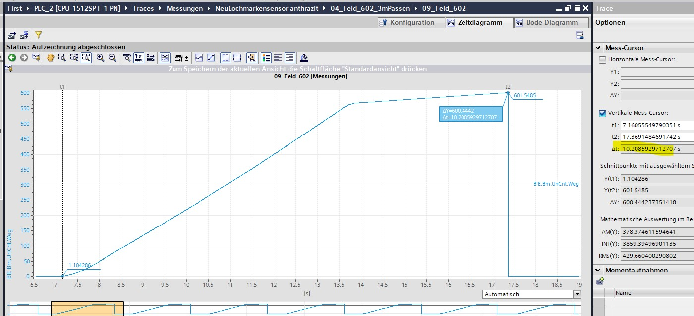
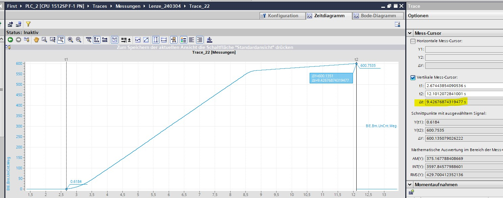

## Geschwindigkeitsauswertung vor und nach Lenze Umrichter Biegen
Der FU wurde getauscht und die selben Einstellungen übernommen. Folgend eine Aufzeichnung vor und eine nach dem Umbau
- Vor Umrichter Tausch: Dauer Positionierung 10,2sec
  
- Nach Umrichter Tausch: Dauer Positionierung 9,4sec
  

Also die Zeit - Dauer ist komplett gleich.